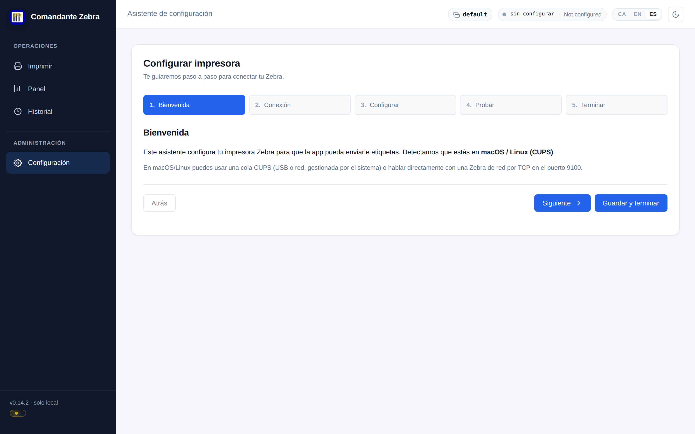

  

<h1 align="center">Comandante Zebra</h1>

  <b>Print Zebra (ZPL) labels from a desktop app — without Zebra's proprietary software, and without a permanent connection to your database.</b>

  
  
  
  
  

  

