<p align="center">
  
</p>

<h1 align="center">Comandante Zebra</h1>

<p align="center">
  <b>Print Zebra (ZPL) labels from a desktop app — without Zebra's proprietary software, and without a permanent connection to your database.</b>
</p>

<p align="center">
  <a href="https://github.com/fcopuerto/comandante_zebra/actions/workflows/build-windows.yml"></a>
  <a href="https://github.com/fcopuerto/comandante_zebra/releases/latest"></a>
  
  
  <a href="LICENSE"></a>
</p>

<p align="center">
  
</p>

---

> 🇬🇧 **English** · 🇪🇸 [Saltar a español](#-español)

---

## 🇬🇧 English

### Why this exists

If you've ever tried to print Zebra labels in a small shop, a warehouse or on a factory floor, you know the pain:

- Zebra's official tools are heavy, Windows-only and expensive to license per machine.
- Most "simple" alternatives break the moment the network goes down or SQL Server hiccups.
- Multi-store setups end up with one bespoke config per machine — nobody knows which version is "the good one".

**Comandante Zebra** is a small desktop app (Flask + pywebview, packaged as a single Windows `.exe`) that fixes those three problems. You type a product code (or scan a barcode), the app pulls the description / price / EAN from your ERP, fills your ZPL template, and the Zebra prints. **And if the network is down, it keeps working** from a local SQLite cache that syncs in the background.

### Features

- 🖨️ **Direct ZPL printing** to Zebra printers (USB, Windows spooler, or raw IP/socket).
- 📝 **ZPL template editor** with live preview and parameterised fields.
- 🔌 **Pluggable datasources** — SQL Server today (ODBC + pure-Python drivers), architected to add more.
- ⚡ **Offline-first cache** in SQLite: print without network, sync when it comes back.
- 👥 **Multi-profile** — run Store A, Store B and Warehouse from the same binary, each with its own templates, DB and printer.
- 🌐 **LAN sharing** — instances discover each other via mDNS/Bonjour and can share templates with a 6-digit PIN (passwords never travel).
- 🪄 **Setup wizard** for first-time configuration (printer + DB + first template).
- 🌓 Light / dark theme.

### Screenshots

<table>
  <tr>
    <td width="50%"><a href="docs/screenshots/12-templates-new.png">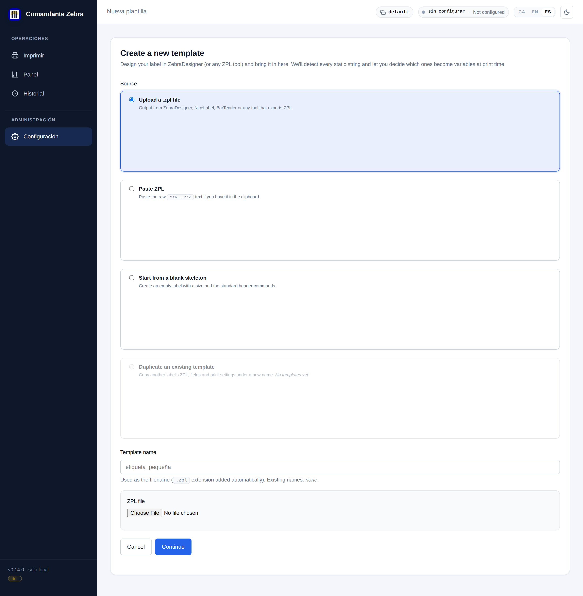</a><p align="center"><i>ZPL template editor with live preview</i></p></td>
    <td width="50%"><a href="docs/screenshots/04-config-network.png">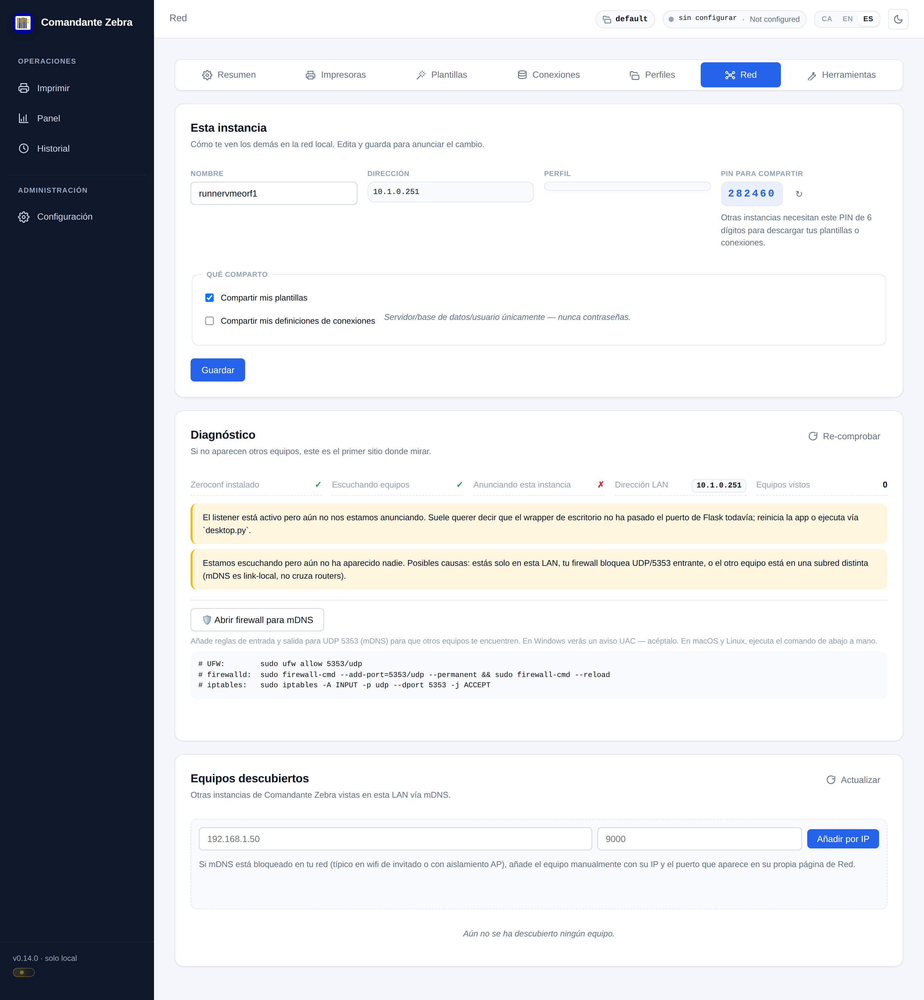</a><p align="center"><i>LAN peer discovery (mDNS) with 6-digit PIN</i></p></td>
  </tr>
  <tr>
    <td width="50%"><a href="docs/screenshots/11-setup.png">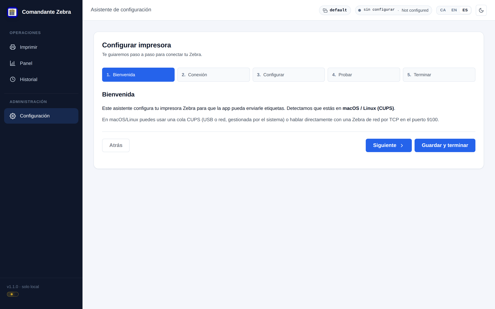</a><p align="center"><i>First-run setup wizard</i></p></td>
    <td width="50%"><a href="docs/screenshots/09-dashboard.png">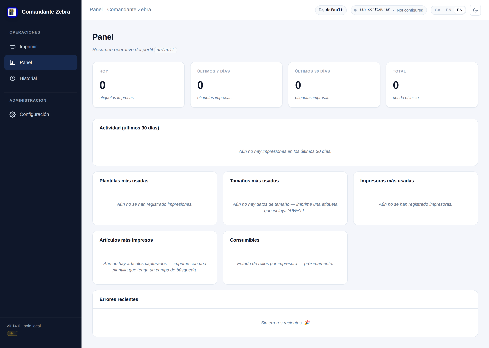</a><p align="center"><i>Dashboard</i></p></td>
  </tr>
</table>

<details>
<summary>More screenshots</summary>

<p>
  <a href="docs/screenshots/02-config.png">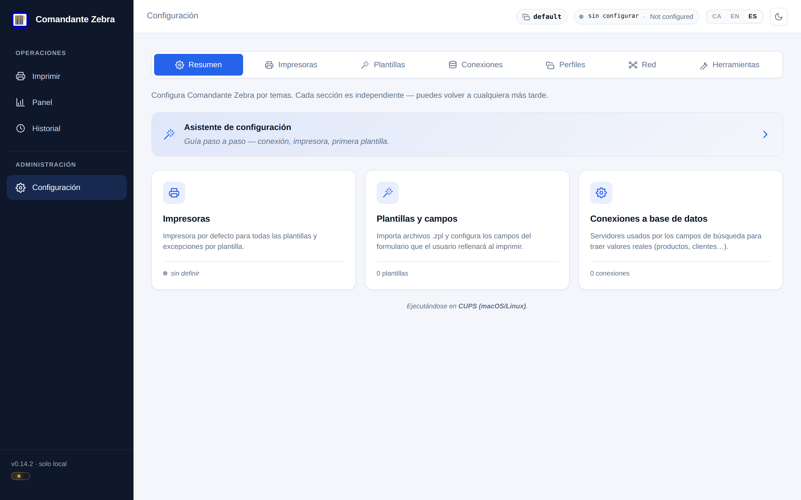</a>
  <a href="docs/screenshots/03-config-connections.png">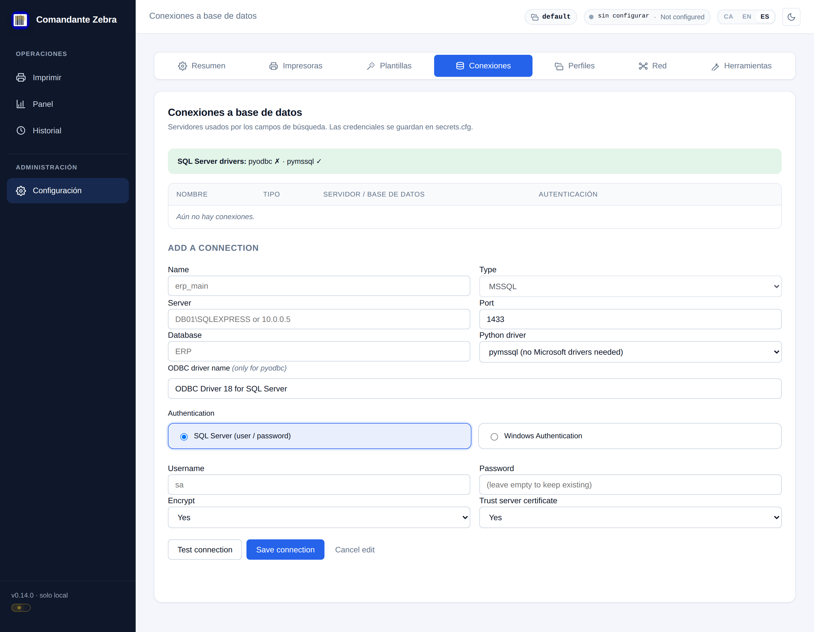</a>
  <a href="docs/screenshots/05-config-printers.png">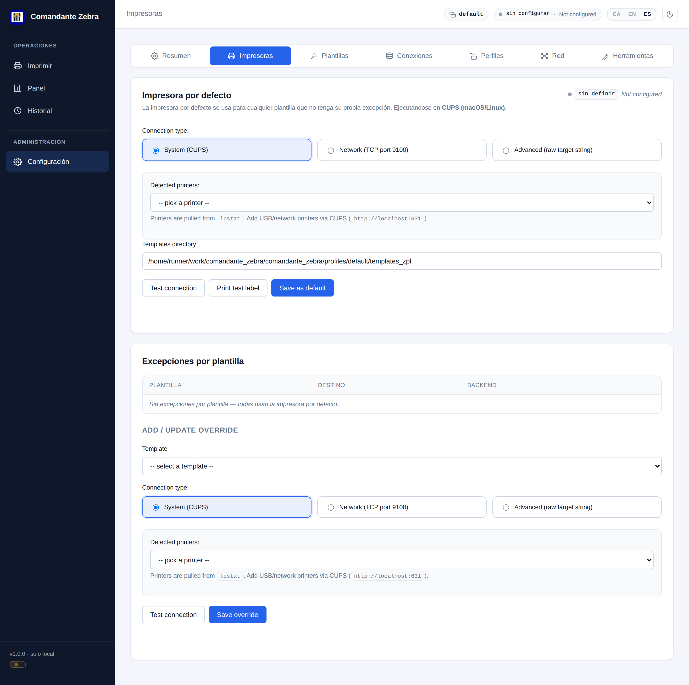</a>
  <a href="docs/screenshots/06-config-profiles.png">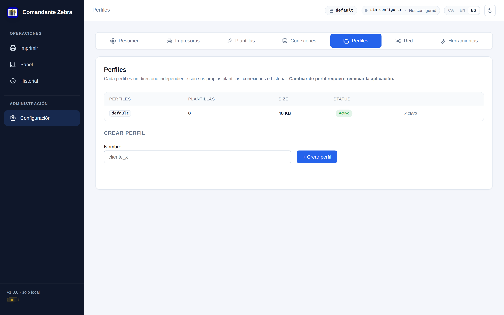</a>
  <a href="docs/screenshots/07-config-templates.png">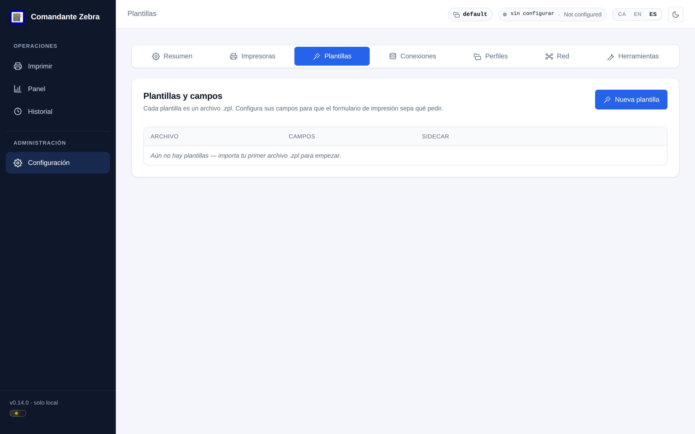</a>
  <a href="docs/screenshots/08-config-tools.png">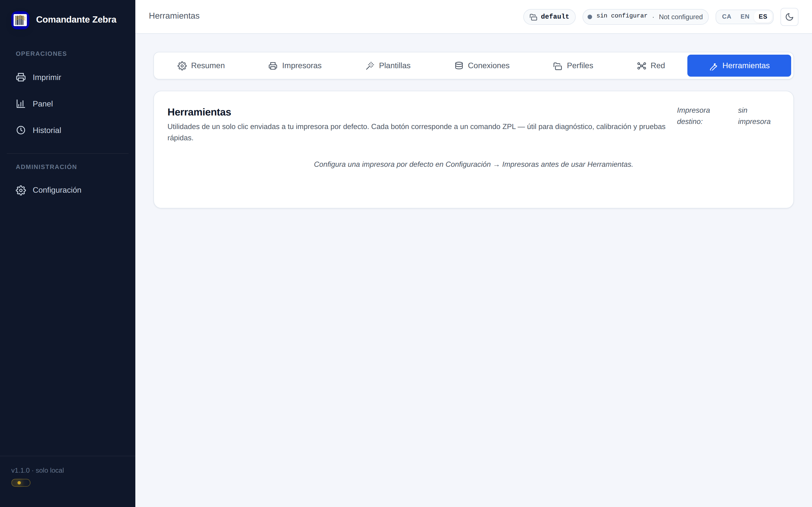</a>
  <a href="docs/screenshots/10-history.png">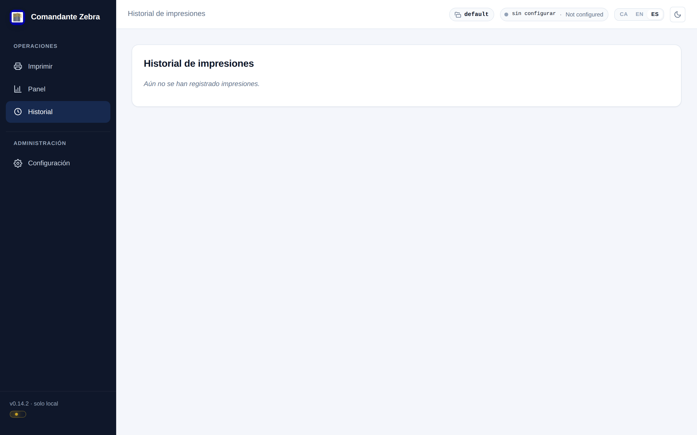</a>
</p>

> Screenshots are auto-generated by [a GitHub Actions workflow](.github/workflows/screenshots.yml) using Playwright. They refresh automatically whenever the UI changes — see [`scripts/take_screenshots.py`](scripts/take_screenshots.py).

</details>

### Quick start (Windows)

1. Go to [Releases](https://github.com/fcopuerto/comandante_zebra/releases/latest) and download `ComandanteZebra.exe`.
2. Run it. On first launch it creates `C:\Users\<your-user>\.comandante_zebra\` with an empty `default` profile.
3. Open the wizard from **Settings → Wizard** and configure your printer + datasource.

> If there's no published release yet, you can grab the latest CI build from the **Actions** tab (artifact `ComandanteZebra-windows`).

#### About the Windows SmartScreen warning

The `.exe` isn't signed with a commercial code-signing certificate, so SmartScreen will show **"Windows protected your PC"** the first time. That's normal for any new unsigned binary. To run it: click **More info** → **Run anyway**. Windows remembers it after the first launch.

To verify you downloaded exactly the `.exe` that CI built, every release also ships a `ComandanteZebra.exe.sha256` file. Check it with:

```powershell
Get-FileHash ComandanteZebra.exe -Algorithm SHA256
# Must match the contents of ComandanteZebra.exe.sha256
```

#### Linux (.deb / .rpm)

Linux ships a **browser-mode** build: it starts a local server and opens your default browser instead of a native window, so there's **no WebKitGTK dependency** and it runs on any glibc desktop (Linux Mint 21/22 included). Download `comandante-zebra_<ver>_amd64.deb` (Debian/Ubuntu/Mint) or the `.rpm` (Fedora/openSUSE) from the [latest release](https://github.com/fcopuerto/comandante_zebra/releases/latest):

```bash
sudo apt install ./comandante-zebra_*_amd64.deb   # or: sudo dnf install ./comandante-zebra-*.rpm
comandante-zebra                                   # or launch "Comandante Zebra" from the app menu
```

##### Printing on Linux (USB)

The app has **no direct USB path** — on Linux it prints through **CUPS** (`lp -o raw`). A networked Zebra needs no setup: just point the printer target at `tcp://IP:9100`. For a **USB** Zebra, register it once as a **raw** CUPS queue (a queue *with* a driver rasterises and mangles ZPL):

```bash
lpinfo -v | grep usb                                       # find the usb:// URI
sudo lpadmin -p ZebraUSB -E -v 'usb://Zebra/...' -m raw     # raw queue, no driver
```

Then set the printer target in **Settings → Printers** to the queue name (`ZebraUSB`). CUPS (`cups` + `cups-client`) is required for the USB path and is pulled in by the package; a standard Mint desktop ships it anyway.

#### macOS

No macOS binary is published. [Run from source](#run-from-source) or build the `.app` locally with `pyinstaller build_desktop.spec`.

### Run from source

The project uses [**uv**](https://docs.astral.sh/uv/) (fast, reproducible, lockfile-based). Install it first:

```bash
# macOS / Linux:
curl -LsSf https://astral.sh/uv/install.sh | sh

# Windows (PowerShell):
powershell -ExecutionPolicy ByPass -c "irm https://astral.sh/uv/install.ps1 | iex"
```

Then:

```bash
git clone https://github.com/fcopuerto/comandante_zebra.git
cd comandante_zebra

# Runtime + pure-Python SQL Server driver (recommended):
uv sync --extra mssql-pure

# Launch the desktop app:
uv run python desktop.py
```

This creates a `.venv/` with the right Python version and installs the locked dependencies.

Web-server only (no native window — useful for browser-based dev):

```bash
uv run python app.py
# then open http://127.0.0.1:5000
```

#### Optional extras

| For… | Command |
| --- | --- |
| Pure-Python SQL Server (no MS drivers) | `uv sync --extra mssql-pure` |
| SQL Server with Microsoft ODBC Driver 18 | `uv sync --extra mssql-odbc` |
| Packaging with PyInstaller | `uv sync --group build` |
| All of the above | `uv sync --extra mssql-pure --group build` |

> If you'd rather use plain pip, the `requirements.txt`, `requirements-mssql-pure.txt` and `requirements-mssql-odbc.txt` files still work as before.

### Building the executable

The Windows `.exe` is built automatically by GitHub Actions on every push to `main` (workflow [`build-windows.yml`](.github/workflows/build-windows.yml)). To build manually on any platform:

```bash
uv sync --extra mssql-pure --group build
uv run pyinstaller --noconfirm --clean build_desktop.spec
# Outputs:
#   dist/ComandanteZebra.exe   (Windows)
#   dist/ComandanteZebra.app   (macOS)
```

PyInstaller does **not** cross-compile: to produce the `.exe` you need to run it on Windows (or use the Actions workflow).

### LAN discovery & peer sharing

Comandante Zebra automatically detects other instances on the same LAN (via mDNS / Bonjour) and lets you **download templates and connection definitions** between them. Useful when several stores or workstations share the same label catalogue.

**How it works:**

- Each instance announces itself as `_comandante-zebra._tcp.local.` on the LAN.
- In **Settings → Network** you'll see your own ID, IP, profile and a **6-digit PIN** generated on first launch.
- To pull from a peer, open its card, type their PIN and pick what you want to import.
- By default only **templates** are shared (.zpl + sidecar). **Connections** (server / database) require an explicit toggle and **never travel with passwords** — the receiver enters their own credentials after import.

**If peers don't show up:** check **Settings → Network → Diagnostics**. Common causes: firewall blocking UDP/5353, missing Bonjour Service on Windows (install Apple's "Bonjour Print Services"), or peers on a different subnet (mDNS is link-local).

### Architecture

```
desktop.py            ← desktop wrapper (pywebview)
app.py                ← pure WSGI entry point
zebra/                ← main package
    __init__.py       ← create_app(base_dir=...)
    profiles.py       ← multi-profile management (folder-per-profile)
    routes/           ← Flask blueprints (labels, config, templates)
    datasources/      ← connectors (mssql, type registry)
    lookup_cache.py   ← SQLite cache for lookups (offline-first)
    cache_scheduler.py← background refresh
    zpl.py / preview.py / printer.py
templates/, static/   ← UI (Jinja2 + vanilla JS)
seed_profiles/        ← seed profile copied to user dir on first run
build_desktop.spec    ← PyInstaller recipe
.github/workflows/    ← CI (Windows .exe, screenshots)
docs/screenshots/     ← auto-generated UI screenshots
```

#### User data layout

When run as `.exe`, user data lives outside the bundle so it survives upgrades:

```
~/.comandante_zebra/
├── profiles/
│   ├── .active
│   └── default/
│       ├── config.cfg
│       ├── secrets.cfg     (not versioned)
│       ├── labels.db
│       └── templates_zpl/
└── app.log
```

If you upgrade from a pre-rebrand version that used `~/.zebra_labels/`, the app renames it automatically on first launch.

### Contributing

Issues and PRs welcome. If you have a Zebra workflow that doesn't fit the current model (different printer family, weird ERP, particular template structure), open an issue describing the use case — that's how the datasource and template systems got generic in the first place.

### License

[MIT](LICENSE) © 2026 Fran Puerto

---

## 🇪🇸 Español

### Por qué existe

Si alguna vez has intentado imprimir etiquetas Zebra en una tienda pequeña, en un almacén o en una fábrica, conoces el dolor:

- Las herramientas oficiales de Zebra son pesadas, solo Windows y se licencian por máquina.
- Las alternativas "sencillas" se rompen en cuanto se cae la red o SQL Server tiene un mal día.
- Los entornos multi-tienda acaban con una configuración a medida por máquina — y nadie sabe cuál es "la buena".

**Comandante Zebra** es una pequeña app de escritorio (Flask + pywebview, empaquetada como `.exe` de Windows) que resuelve esos tres problemas. Tecleas un código de producto (o escaneas un código de barras), la app saca descripción / precio / EAN del ERP, rellena tu plantilla ZPL, y la Zebra imprime. **Y si la red se cae, sigue funcionando** contra una caché SQLite local que sincroniza en segundo plano.

### Funcionalidades

- 🖨️ **Impresión ZPL directa** a impresoras Zebra (USB, spooler de Windows o IP/socket).
- 📝 **Editor de plantillas ZPL** con previsualización y campos parametrizables.
- 🔌 **Datasources conectables** — hoy SQL Server (drivers ODBC y pure-Python), arquitectura preparada para añadir más.
- ⚡ **Caché offline** en SQLite: imprime sin conexión, sincroniza cuando vuelve la red.
- 👥 **Multi-perfil** — tienda A, tienda B y almacén desde el mismo binario, cada uno con sus plantillas, BD e impresora.
- 🌐 **Compartir en LAN** — las instancias se descubren por mDNS/Bonjour y comparten plantillas con un PIN de 6 dígitos (las contraseñas nunca viajan).
- 🪄 **Asistente** inicial para configurar impresora + BD + primera plantilla.
- 🌓 Tema claro / oscuro.

### Capturas

<table>
  <tr>
    <td width="50%"><a href="docs/screenshots/12-templates-new.png"></a><p align="center"><i>Editor ZPL con previsualización</i></p></td>
    <td width="50%"><a href="docs/screenshots/04-config-network.png"></a><p align="center"><i>Descubrimiento mDNS con PIN de 6 dígitos</i></p></td>
  </tr>
  <tr>
    <td width="50%"><a href="docs/screenshots/11-setup.png"></a><p align="center"><i>Asistente inicial</i></p></td>
    <td width="50%"><a href="docs/screenshots/09-dashboard.png"></a><p align="center"><i>Panel principal</i></p></td>
  </tr>
</table>

<details>
<summary>Más capturas</summary>

<p>
  <a href="docs/screenshots/02-config.png"></a>
  <a href="docs/screenshots/03-config-connections.png"></a>
  <a href="docs/screenshots/05-config-printers.png"></a>
  <a href="docs/screenshots/06-config-profiles.png"></a>
  <a href="docs/screenshots/07-config-templates.png"></a>
  <a href="docs/screenshots/08-config-tools.png"></a>
  <a href="docs/screenshots/10-history.png"></a>
</p>

> Las capturas se generan automáticamente por [un workflow de GitHub Actions](.github/workflows/screenshots.yml) usando Playwright. Se refrescan solas cada vez que cambia la UI — ver [`scripts/take_screenshots.py`](scripts/take_screenshots.py).

</details>

### Inicio rápido (Windows)

1. Ve a [Releases](https://github.com/fcopuerto/comandante_zebra/releases/latest) y descarga `ComandanteZebra.exe`.
2. Ejecútalo. La primera vez creará `C:\Users\<tu-usuario>\.comandante_zebra\` con un perfil `default` vacío.
3. Lanza el asistente desde **Configuración → Asistente** y configura tu impresora y conexión.

> Si todavía no hay un release publicado, puedes bajar el último build de CI desde la pestaña **Actions** (artifact `ComandanteZebra-windows`).

#### Aviso de Windows SmartScreen

Como el `.exe` no está firmado con un certificado comercial, SmartScreen mostrará **"Windows protected your PC"** la primera vez. Es normal con cualquier binario nuevo sin reputación. Para abrirlo: **Más información** → **Ejecutar de todas formas**. Windows lo recordará tras la primera ejecución.

Para verificar que descargaste exactamente el `.exe` que construyó CI, cada release adjunta un archivo `ComandanteZebra.exe.sha256`. Compara el hash con:

```powershell
Get-FileHash ComandanteZebra.exe -Algorithm SHA256
# Debe coincidir con el contenido de ComandanteZebra.exe.sha256
```

#### Linux (.deb / .rpm)

Linux usa un build en **modo navegador**: arranca un servidor local y abre tu navegador en vez de una ventana nativa, así que **no depende de WebKitGTK** y corre en cualquier escritorio glibc (Linux Mint 21/22 incluidos). Descarga `comandante-zebra_<ver>_amd64.deb` (Debian/Ubuntu/Mint) o el `.rpm` (Fedora/openSUSE) del [último release](https://github.com/fcopuerto/comandante_zebra/releases/latest):

```bash
sudo apt install ./comandante-zebra_*_amd64.deb   # o: sudo dnf install ./comandante-zebra-*.rpm
comandante-zebra                                   # o abre "Comandante Zebra" desde el menú de apps
```

##### Impresión en Linux (USB)

La app **no tiene path USB directo** — en Linux imprime vía **CUPS** (`lp -o raw`). Una Zebra en red no necesita configuración: apunta el target de impresora a `tcp://IP:9100`. Para una Zebra **USB**, dala de alta una vez como cola CUPS **raw** (una cola *con* driver rasteriza y destroza el ZPL):

```bash
lpinfo -v | grep usb                                       # localizar la URI usb://
sudo lpadmin -p ZebraUSB -E -v 'usb://Zebra/...' -m raw     # cola raw, sin driver
```

Después pon el target de impresora en **Configuración → Impresoras** con el nombre de la cola (`ZebraUSB`). CUPS (`cups` + `cups-client`) es obligatorio para el path USB y lo instala el propio paquete; un escritorio Mint normal ya lo trae.

#### macOS

No se publica binario de macOS. [Ejecuta desde fuente](#ejecutar-desde-fuente) o construye el `.app` localmente con `pyinstaller build_desktop.spec`.

### Ejecutar desde fuente

El proyecto se gestiona con [**uv**](https://docs.astral.sh/uv/) (rápido, reproducible, con lockfile). Si no lo tienes:

```bash
# macOS / Linux:
curl -LsSf https://astral.sh/uv/install.sh | sh

# Windows (PowerShell):
powershell -ExecutionPolicy ByPass -c "irm https://astral.sh/uv/install.ps1 | iex"
```

Después:

```bash
git clone https://github.com/fcopuerto/comandante_zebra.git
cd comandante_zebra

# Runtime + driver SQL Server pure-Python (recomendado):
uv sync --extra mssql-pure

# Lanzar la app de escritorio:
uv run python desktop.py
```

Esto crea automáticamente un `.venv/` con la versión correcta de Python e instala las dependencias del lockfile.

Solo el servidor web (sin ventana nativa, útil para desarrollo en navegador):

```bash
uv run python app.py
# luego abre http://127.0.0.1:5000
```

#### Extras opcionales

| Para… | Comando |
| --- | --- |
| SQL Server pure-Python (sin drivers MS) | `uv sync --extra mssql-pure` |
| SQL Server con Microsoft ODBC Driver 18 | `uv sync --extra mssql-odbc` |
| Empaquetar con PyInstaller | `uv sync --group build` |
| Todo lo anterior | `uv sync --extra mssql-pure --group build` |

> Si prefieres pip clásico, los archivos `requirements.txt`, `requirements-mssql-pure.txt` y `requirements-mssql-odbc.txt` siguen funcionando como antes.

### Construir el ejecutable

El `.exe` de Windows se construye automáticamente en GitHub Actions con cada push a `main` (workflow [`build-windows.yml`](.github/workflows/build-windows.yml)). Para construirlo manualmente en cualquier plataforma:

```bash
uv sync --extra mssql-pure --group build
uv run pyinstaller --noconfirm --clean build_desktop.spec
# Salida:
#   dist/ComandanteZebra.exe   (Windows)
#   dist/ComandanteZebra.app   (macOS)
```

PyInstaller **no** hace cross-compile: para generar el `.exe` necesitas ejecutarlo en Windows (o usar el workflow de Actions).

### Red local: descubrimiento y compartir entre instancias

Comandante Zebra detecta automáticamente otras instancias en la misma LAN (vía mDNS / Bonjour) y permite **descargar plantillas y definiciones de conexiones** entre ellas. Útil cuando varias tiendas o máquinas comparten el mismo catálogo de etiquetas.

**Cómo funciona:**

- Cada instancia se anuncia como `_comandante-zebra._tcp.local.` en su LAN.
- En **Configuración → Red** ves tu propio identificador, IP, perfil y un **PIN de 6 dígitos** generado al primer arranque.
- Para descargar de un peer, abres su tarjeta, introduces su PIN y seleccionas qué quieres importar.
- Por defecto solo se comparten **plantillas** (.zpl + sidecar). Las **conexiones** (servidor / base de datos) requieren un toggle aparte y **siempre viajan sin contraseñas** — el receptor introduce sus propias credenciales después de importar.

**Si no aparecen otros equipos:** revisa **Configuración → Red → Diagnóstico**. Causas habituales: firewall bloqueando UDP/5353, falta del servicio Bonjour en Windows (instalar "Bonjour Print Services" de Apple), o peers en otra subred (mDNS es link-local, no cruza routers).

### Arquitectura

```
desktop.py            ← wrapper de escritorio (pywebview)
app.py                ← entry point WSGI puro
zebra/                ← paquete principal
    __init__.py       ← create_app(base_dir=...)
    profiles.py       ← gestión multi-perfil (folder-per-profile)
    routes/           ← blueprints Flask (labels, config, templates)
    datasources/      ← conectores (mssql, registry de tipos)
    lookup_cache.py   ← caché SQLite de lookups (offline-first)
    cache_scheduler.py← refresco en background
    zpl.py / preview.py / printer.py
templates/, static/   ← UI (Jinja2 + JS vanilla)
seed_profiles/        ← perfil semilla que se copia al user dir en el primer run
build_desktop.spec    ← receta PyInstaller
.github/workflows/    ← CI (build Windows .exe, capturas)
docs/screenshots/     ← capturas de UI auto-generadas
```

#### Datos del usuario

Cuando se ejecuta como `.exe`, los datos viven fuera del bundle para sobrevivir a actualizaciones:

```
~/.comandante_zebra/
├── profiles/
│   ├── .active
│   └── default/
│       ├── config.cfg
│       ├── secrets.cfg     (no se versiona)
│       ├── labels.db
│       └── templates_zpl/
└── app.log
```

Si actualizas desde una versión pre-rebrand que usaba `~/.zebra_labels/`, la app la renombra automáticamente en el primer arranque.

### Contribuir

Issues y PRs son bienvenidos. Si tienes un workflow Zebra que no encaja en el modelo actual (familia de impresora distinta, ERP raro, plantillas con estructura particular), abre un issue describiendo el caso — así fue como el sistema de datasources y plantillas se hizo genérico.

### Licencia

[MIT](LICENSE) © 2026 Fran Puerto